## 1.安装Linux基本系统
按照老师下发文档逐步完成即可。

## 2.设置网卡
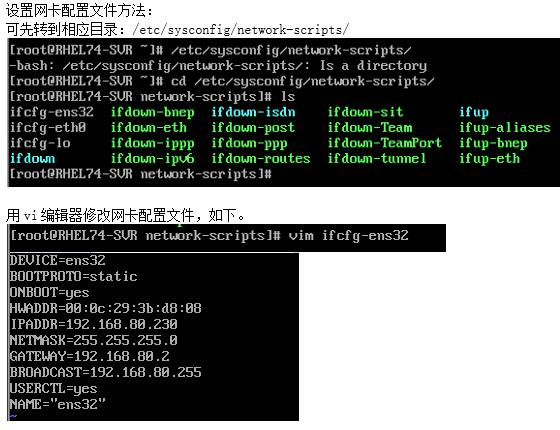
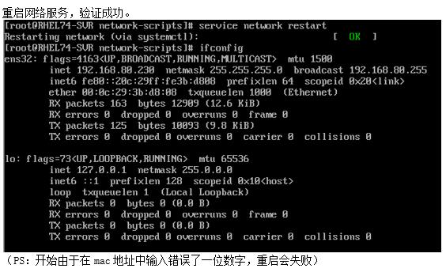

## 3.双向ping通
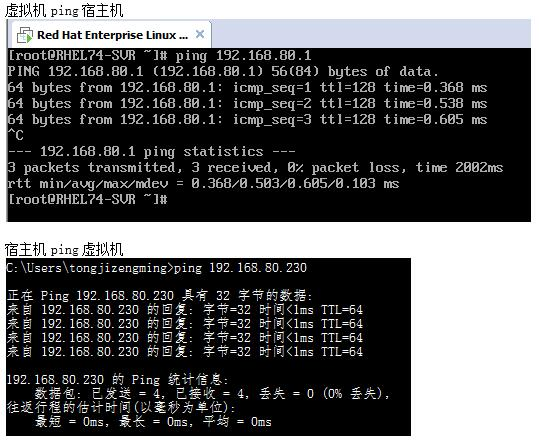

## 4.Secure安装登录
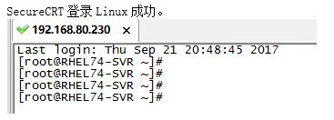
 
## 5.中文显示
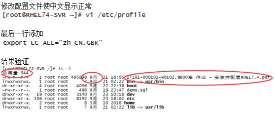

## 6.配置数据库-登录启动
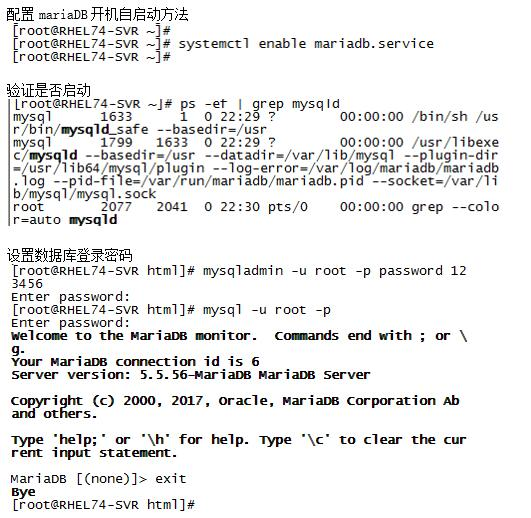
 
## 7.配置数据库-字符集
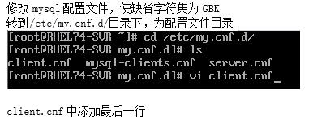

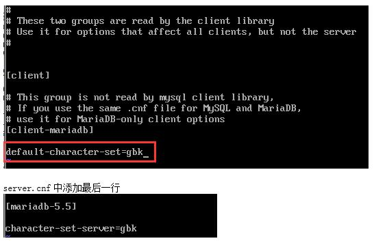

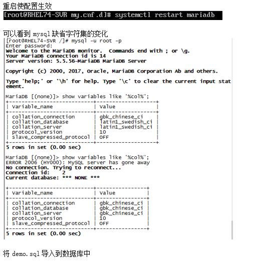

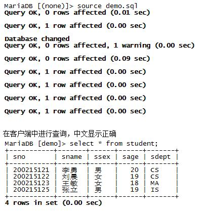
 
## 8.安装配置 PHP Apache

本次作业[参考链接](http://blog.btthly.com/rhel-configure-lamp-server-7-0-installation-apachephpmariadb.html)，其中包含了几乎所有安装配置过程，但是有些地方有误或不同，个人操作如下（红色代表不同）：  

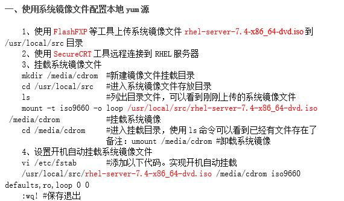
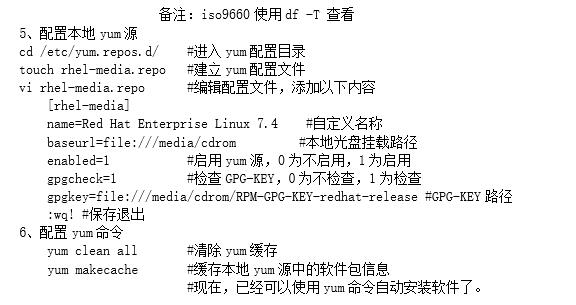
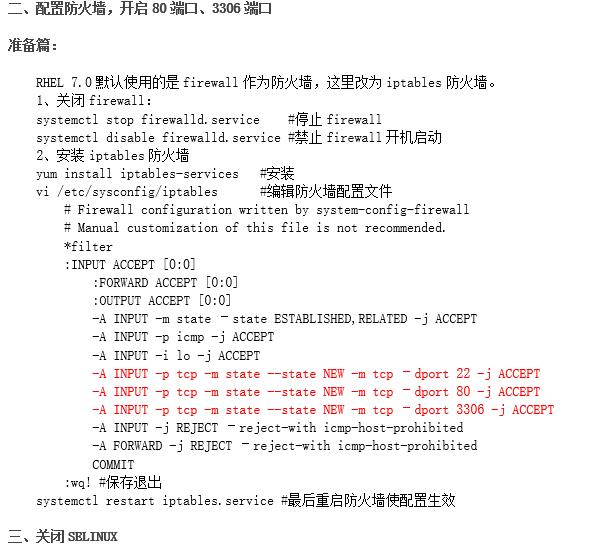
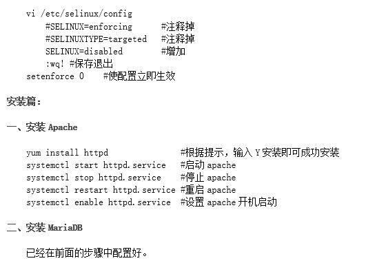
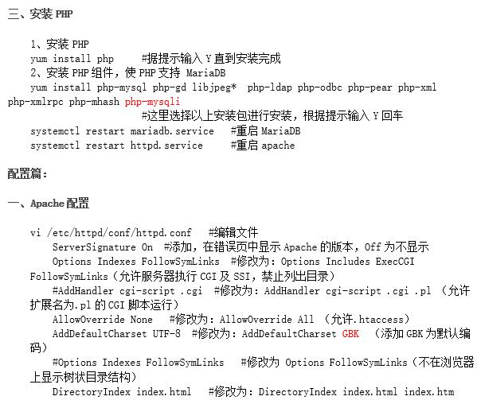
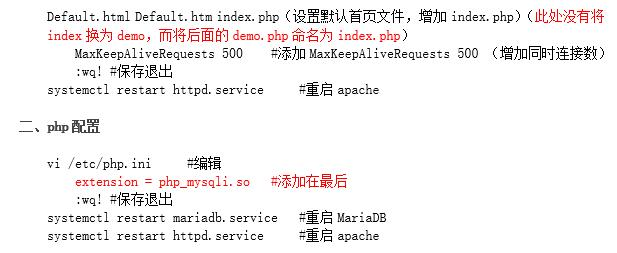
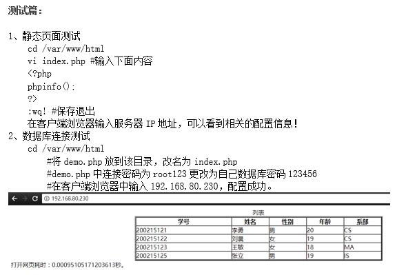

## 9.安装MySQL组件
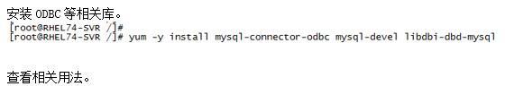
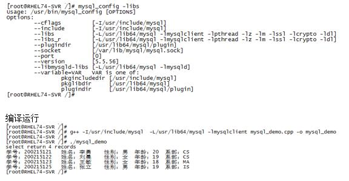

## 10.修改FLASHFXP配置
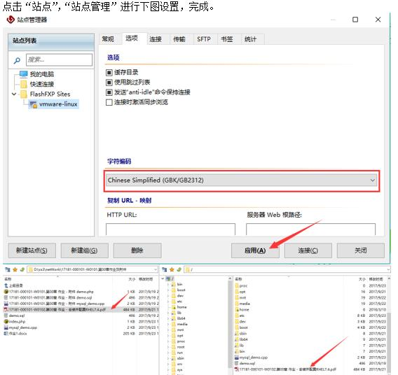

